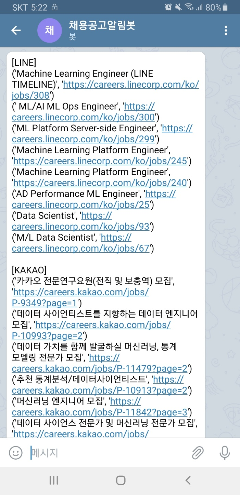

# RA-crawler

Recruit Announcement Crawler Sample

## How to Use

- telegram bot 을 만들어 $BOT_TOKEN 을 준비합니다.
- telegram bot 으로부터 message 를 받을 본인 계정의 $TELEGRAM_PRIVATE_ID 를 준비합니다.
    - 구글링을 통해 어렵지 않게 위의 두 작업을 수행하실 수 있을겁니다.
- 원하는 모든 keyword 를 -k argument 로 입력합니다.

- 예)

```shell
python rac/rac/main.py -b $BOT_TOKEN -t $TELEGRAM_PRIVATE_ID -k ml -k dl -k m/l -k d/l -k machine -k deep -k scientist -k 머신 -k 딥 -k 사이언티스트 -k 사이언스 -k 학습 -k 전문연구
```

- 실행이 완료되면 $TELEGRAM_PRIVATE_ID 계정으로 다음과 같은 메시지가 도착합니다.
  

- 일정 주기로 반복적인 실행을 원할 경우, `.github/workflows/python-app.yml` 을 참고하여 cronjob 으로 메시지를 받을 수 있습니다.
    - 원하는 keywords가 있는 경우 본 프로젝트를 fork 하여 `.github/workflows/python-app.yml` 를 수정 후 사용하시면 됩니다.
        - 1. `BOT_TOKEN` 을 본인이 생성한 bot 의 access token 으로 변경
        - 2. `$TELEGRAM_PRIVATE_ID` 를 본인 계정 id 로 변경
        - 3. `-k`의 value 를 본인이 원하는 keywords 로 변경
            - 여러 keyword 가 있을 경우 `-k val_1`, `-k val_2`, ... 계속 추가하시면 됩니다.
                - 채용 공고 제목에서 해당 val 을 **포함하는** 모든 채용공고가 출력됩니다.
- 예를 들어, 현재 제 github action 은 해당 Telegram Bot 이 'naver', 'kakao', 'line' 의 채용 공고 페이지에서 {'ml', 'dl', '
  m/l', 'd/l', 'machine', 'deep', 'scientist', '머신', '
  딥', '사이언티스트', '사이언스', '학습', '전문연구'} 중 한 단어를 포함하는 모든 채용공고와 그 링크를 매일 아침 08:00 경에 저에게 보내는 역할을 하고 있습니다.
    - 단, github 에서 무료로 hosting 해주는 서버 자원을 사용하고 있어 delay time 이 약 30 분은 됩니다.

## TODO

- 마감날짜 표시
- 신규 채용 공고 따로 표시하는 작업 추가
- 다른 회사 추가
    - 현재 naver, kakao, line 의 채용공고만 포함
- 오타 -> 비슷한 단어로 보정해서 검색
    - needs stateful DB so maybe implemeted later...